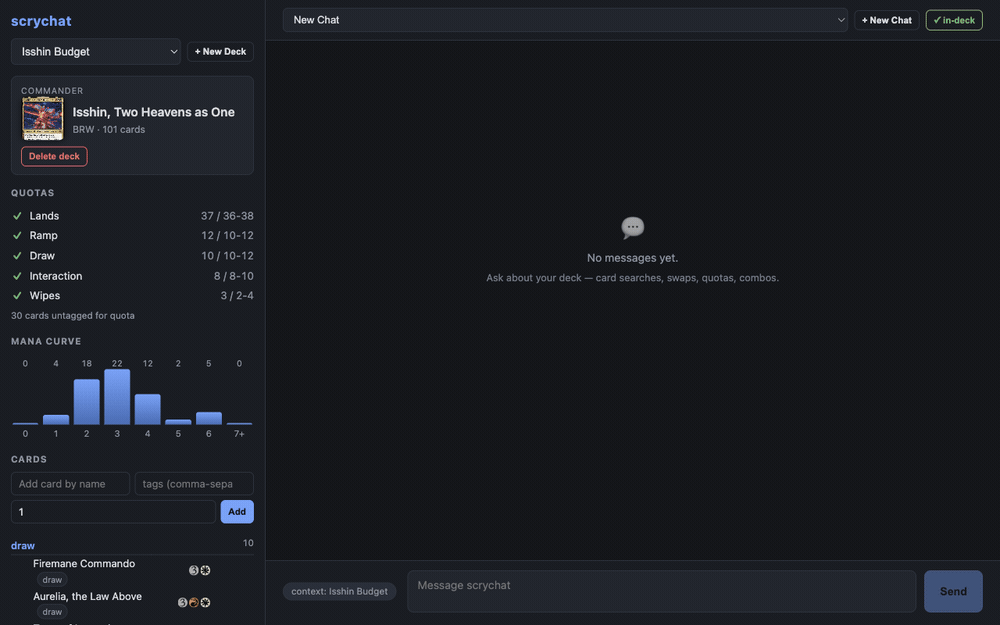

# scrychat

A Commander/EDH deck-building assistant that reasons in **functional card roles**
("token doubler", "sac outlet", "extra combat phase") and enumerates candidates
from the real card pool — Scryfall's community oracle tags plus Commander
Spellbook's combo database — instead of leaning on EDHREC-style popularity
lists.

One MCP server, two frontends:
- **Claude Code chat** — mount the server in a terminal session.
- **Local browser app** — chat panel + deck panel, same server underneath.

Arena-only collection tracking via a local snapshot import — link your Arena
log folder or drop `Player.log` in the web UI (Detailed Logs must be enabled
in Arena) to see owned/missing on deck cards and `owned` flags in tool
results; paper collections are out of scope, and the snapshot stays local in
`collection.json`. No per-token API billing — everything runs on your Claude
subscription.

## Demo



One prompt builds a Teysa Karlov aristocrats deck: the chat streams tool chips
as it searches sac outlets, returns a reply with hoverable `[[card]]` links
(card image on hover), and clicking a card toggles it into the deck panel —
role groups, quota bars, and mana curve updating live.

## Requirements

- Node 24+
- pnpm 10+ (pnpm only, never npm)
- Claude Code, signed in with a subscription (Pro/Max)

The browser app authenticates via the Claude Agent SDK using your Claude Code
subscription session — no `ANTHROPIC_API_KEY` needed. If you have a stale
`ANTHROPIC_API_KEY` set in your environment, **unset it** — its presence
overrides subscription auth and will break the web chat.

```
unset ANTHROPIC_API_KEY
```

## Setup

```
pnpm install
pnpm -r build
```

### Claude Code

Open a Claude Code session at the repo root. `.mcp.json` registers the
`scrychat` MCP server (stdio, `packages/mcp/dist/index.js`), and the
`edh-deck-builder` skill under `.claude/skills/` auto-loads with query recipes
and quota rules.

Example prompts:
- "What are the payoffs for Parallel Lives?"
- "Find all token doublers legal in Commander under $5"
- "Alternatives to Doubling Season in Selesnya under $20"
- "Build a $150 deck around Isshin"

### Browser app

```
pnpm --filter @scrychat/web dev
```

Open `http://localhost:8787`. Same MCP server and skill, chat panel plus a
deck panel showing cards by role, quota bars, mana curve, and card images.

## How it works

- **packages/core** — Scryfall and Commander Spellbook clients, the local tag
  index, functional-alternatives scoring, and deck file CRUD. Decks are JSON
  files under `decks/`.
- **packages/mcp** — MCP stdio server exposing 10 tools over core: card
  search/lookup, tag search, alternatives, combo search, and deck
  list/create/get/add/remove.
- **apps/web** — Express + Claude Agent SDK backend, React frontend, SSE
  streaming between chat and deck panel.

Regenerate the tag index (from Scryfall's `oracle_tags` bulk export):

```
pnpm --filter @scrychat/core build-tag-index
```

### Evals

`evals/run-tier-a.mjs` runs the golden set (`evals/golden.md`) against the
live tool surface; results land in `evals/RESULTS.md` and transcripts in
`evals/transcripts/`.

## Local mirror (optional but recommended)

```
pnpm --filter @scrychat/core ingest
```

Downloads Scryfall's `oracle_cards`/`default_cards`/`oracle_tags` bulk exports
and Commander Spellbook's variants dump into `data/downloads/` (cached, ~1GB)
and populates a local SQLite mirror at `data/scrychat.db`. Takes ~2 minutes on
a normal connection.

What moves local vs. stays live:
- **Local (instant, no network round-trip):** `get_card`, `search_tags`,
  `find_alternatives`, `find_combos` — card lookup, tag search, functional
  alternatives, and combo search all hit `data/scrychat.db`.
- **Still live:** `search_cards` — full Scryfall search syntax (`otag:`,
  `id<=`, `usd<`, `prefer:usd-low`, etc.) proxies the live API so query syntax
  stays exactly what the skill teaches.

Refresh with the same command — Scryfall's bulk data updates daily, so
re-running `pnpm --filter @scrychat/core ingest` picks up new prices, cards,
and tags. Use `--cards` / `--prices` / `--tags` / `--combos` to refresh one
dataset at a time.

Without the local mirror, every tool falls back to live API calls — nothing
breaks, it's just slower. One caveat: a running MCP server or web app decides
local-vs-live once at first use, so restart it after running the ingest for
the first time (or after a refresh) to pick up the mirror.

`scrychat.config.json` at repo root: `linkifyPass` (default `false`) runs a
second cheap-model pass over each reply to wrap any bare card names the model
missed in `[[...]]`, before persisting — off by default, no extra cost/latency.

## Attribution & data

Card data and images are © Wizards of the Coast, used under WotC's
[Fan Content Policy](https://company.wizards.com/en/legal/fancontentpolicy).
scrychat is unofficial Fan Content, not approved or endorsed by Wizards of
the Coast.

Functional tag and card data from [Scryfall](https://scryfall.com), including
community Tagger oracle tags — thank you to Scryfall and the Tagger
contributors. Combo data from
[Commander Spellbook](https://commanderspellbook.com) — thank you to that
project and its contributors.

This is a personal tool. Don't redistribute derived datasets (tag index,
deck exports, etc.) publicly.
